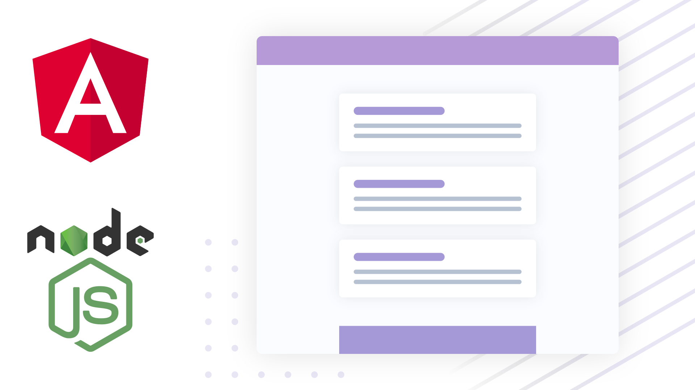

# Notes App (MEAN Stack)

<!-- TODO: Change links when you upload video -->

<!-- ##### Watch the full tutorial on [Youtube](https://youtu.be/YGCDAXFWAZo)!  -->
##### Tutorial coming soon! [Subscribe](https://www.youtube.com/channel/UCbwsS1m4Hib6R-9F1alus_A) to get notified when it is released.

##### This repository contains the code for both the Angular frontend application as well as the NodeJS API. 

> Don't forget to run `npm install` in both the **notes-api** and **notes-frontend** folders to install dependencies